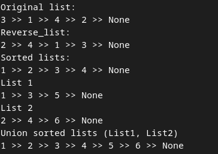

### Завдання 1. Структури даних. Сортування. Робота з однозв'язним списком ([task1.py](task1.py))
Для реалізації однозв'язного списку (приклад реалізації можна взяти з конспекту) необхідно:

 - написати функцію, яка реалізує реверсування однозв'язного списку, змінюючи посилання між вузлами;
 - розробити алгоритм сортування для однозв'язного списку, наприклад, сортування вставками або злиттям;
 - написати функцію, що об'єднує два відсортовані однозв'язні списки в один відсортований список.

### Результат (Завдання 1).

.

### Завдання 2. Рекурсія. Створення фрактала “дерево Піфагора” за допомогою рекурсії. ([task2.py](task2.py))

Необхідно написати програму на Python, яка використовує рекурсію для створення фрактала “дерево Піфагора”. Програма має візуалізувати фрактал “дерево Піфагора”, і користувач повинен мати можливість вказати рівень рекурсії.


### Результат (Завдання 2).

рівень рекурсії 5


рівень рекурсії 10


### Завдання 3. Дерева, алгоритм Дейкстри. ([task3.py](task3.py))

Розробіть алгоритм Дейкстри для знаходження найкоротших шляхів у зваженому графі, використовуючи бінарну купу. Завдання включає створення графа, використання піраміди для оптимізації вибору вершин та обчислення найкоротших шляхів від початкової вершини до всіх інших.

### Результат (Завдання 3).


### Завдання 4. Візуалізація піраміди. ([task4.py](task4.py))

Наступний код виконує побудову бінарних дерев. Виконайте аналіз коду, щоб зрозуміти, як він працює.

```
import uuid

import networkx as nx
import matplotlib.pyplot as plt


class Node:
  def __init__(self, key, color="skyblue"):
    self.left = None
    self.right = None
    self.val = key
    self.color = color # Додатковий аргумент для зберігання кольору вузла
    self.id = str(uuid.uuid4()) # Унікальний ідентифікатор для кожного вузла


def add_edges(graph, node, pos, x=0, y=0, layer=1):
  if node is not None:
    graph.add_node(node.id, color=node.color, label=node.val) # Використання id та збереження значення вузла
    if node.left:
      graph.add_edge(node.id, node.left.id)
      l = x - 1 / 2 ** layer
      pos[node.left.id] = (l, y - 1)
      l = add_edges(graph, node.left, pos, x=l, y=y - 1, layer=layer + 1)
    if node.right:
      graph.add_edge(node.id, node.right.id)
      r = x + 1 / 2 ** layer
      pos[node.right.id] = (r, y - 1)
      r = add_edges(graph, node.right, pos, x=r, y=y - 1, layer=layer + 1)
  return graph


def draw_tree(tree_root):
  tree = nx.DiGraph()
  pos = {tree_root.id: (0, 0)}
  tree = add_edges(tree, tree_root, pos)

  colors = [node[1]['color'] for node in tree.nodes(data=True)]
  labels = {node[0]: node[1]['label'] for node in tree.nodes(data=True)} # Використовуйте значення вузла для міток

  plt.figure(figsize=(8, 5))
  nx.draw(tree, pos=pos, labels=labels, arrows=False, node_size=2500, node_color=colors)
  plt.show()


# Створення дерева
root = Node(0)
root.left = Node(4)
root.left.left = Node(5)
root.left.right = Node(10)
root.right = Node(1)
root.right.left = Node(3)

# Відображення дерева
draw_tree(root)
```

.

Використовуючи як базу цей код, побудуйте функцію, що буде візуалізувати бінарну купу.
 - Примітка. Суть завдання полягає у створенні дерева із купи.

### Результат (Завдання 4).

.

### Завдання 5. Візуалізація обходу бінарного дерева. ([task5.py](task5.py))

Використовуючи код із завдання 4 для побудови бінарного дерева, необхідно створити програму на Python, яка візуалізує обходи дерева: у глибину та в ширину.

Вона повинна відображати кожен крок у вузлах з різними кольорами, використовуючи 16-систему RGB (приклад #1296F0). Кольори вузлів мають змінюватися від темних до світлих відтінків, залежно від послідовності обходу. Кожен вузол при його відвідуванні має отримувати унікальний колір, який візуально відображає порядок обходу.

 - Примітка. Використовуйте стек та чергу, НЕ рекурсію

### Результат (Завдання 5).

Обхід в ширину (BFS):

.

Обхід в глибину (DFS):

.


### Завдання 6. Жадібні алгоритми та динамічне програмування. ([task6.py](task6.py))

Необхідно написати програму на Python, яка використовує два підходи — жадібний алгоритм та алгоритм динамічного програмування для розв’язання задачі вибору їжі з найбільшою сумарною калорійністю в межах обмеженого бюджету.

Кожен вид їжі має вказану вартість і калорійність. Дані про їжу представлені у вигляді словника, де ключ — назва страви, а значення — це словник з вартістю та калорійністю.

```
items = {
    "pizza": {"cost": 50, "calories": 300},
    "hamburger": {"cost": 40, "calories": 250},
    "hot-dog": {"cost": 30, "calories": 200},
    "pepsi": {"cost": 10, "calories": 100},
    "cola": {"cost": 15, "calories": 220},
    "potato": {"cost": 25, "calories": 350}
}
```
Розробіть функцію <b>greedy_algorithm</b> жадібного алгоритму, яка вибирає страви, максимізуючи співвідношення калорій до вартості, не перевищуючи заданий бюджет.

Для реалізації алгоритму динамічного програмування створіть функцію <b>dynamic_programming</b>, яка обчислює оптимальний набір страв для максимізації калорійності при заданому бюджеті.

### Завдання 7. Використання методу Монте-Карло. ([task7.py](task7.py))

Необхідно написати програму на Python, яка імітує велику кількість кидків кубиків, обчислює суми чисел, які випадають на кубиках, і визначає ймовірність кожної можливої суми.

Створіть симуляцію, де два кубики кидаються велику кількість разів. Для кожного кидка визначте суму чисел, які випали на обох кубиках. Підрахуйте, скільки разів кожна можлива сума (від 2 до 12) з’являється у процесі симуляції. Використовуючи ці дані, обчисліть імовірність кожної суми.

На основі проведених імітацій створіть таблицю або графік, який відображає ймовірності кожної суми, виявлені за допомогою методу Монте-Карло.

Таблиця ймовірностей сум при киданні двох кубиків виглядає наступним чином.

.

Порівняйте отримані за допомогою методу Монте-Карло результати з аналітичними розрахунками, наведеними в таблиці вище.
